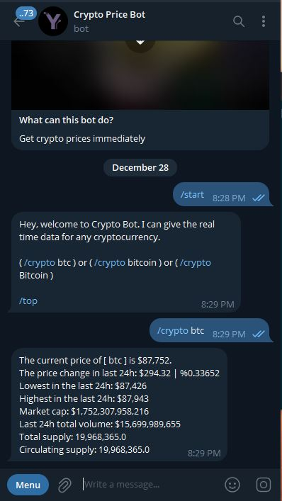
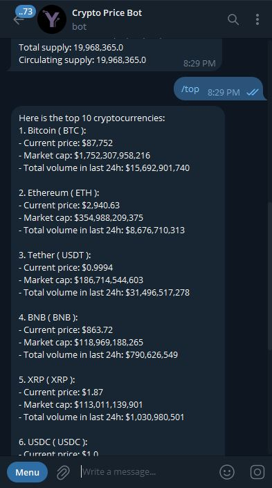

# Get Crypto price with Telegram bot

 |  |  | 

This is a simple **Telegram bot** using Python that delivers **real-time updates on cryptocurrencies**.

> It can deliver: **Price**, **24h change price and percentage**, **24h lowest** and **highest price**, **market cap**, **total volume**, **total supply**, **circulating supply**

I used free **[API](https://www.coingecko.com/en/api)** in this project so it has limited credits.

## Set up

### Prerequisites

> - **Python 3.7** or higher installed on your system
> - **A Telegram account** for creating your bot
> - **API** get a free API **[here](https://www.coingecko.com/en/api)**

*let's dive in*

> 0. [Download](https://github.com/ysnalpr/Get_crypto_prices_telegram_bot/archive/refs/heads/master.zip) the project.


> 1. Change **.env-sample** to **.env**  and add required data [API_KEY] and [BOT_TOKEN]

> 2. Create a virtualenvironment using the command below on the project directory.
```
$ python -m venv env
```

> 3. Install project dependencies using the command below on the command prompt.
```
$ pip install -r requirements.txt
```

> 4. Run the project.
```
$ python main.py
```

## Contributing

**Pull requests are welcome.**

## License

[MIT](https://choosealicense.com/licenses/mit/)